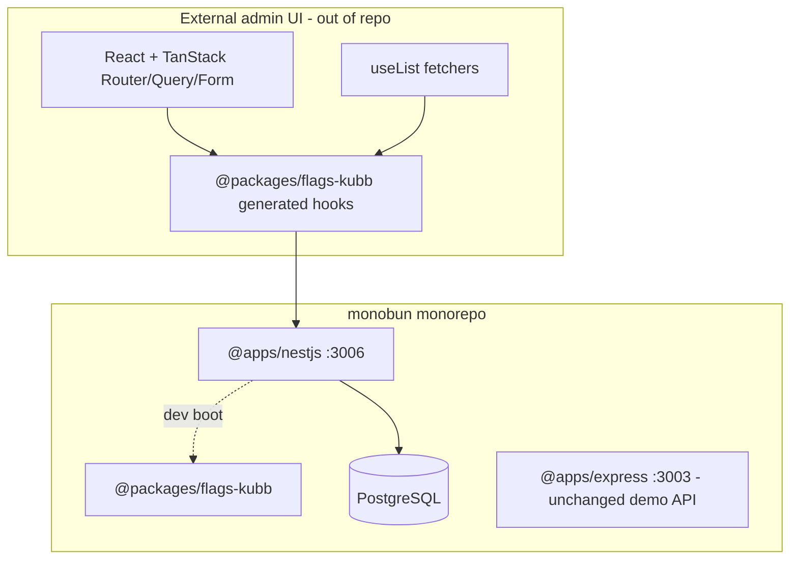

# NestJS multi-tenant feature flags control plane

## Product context (agreed)

| Topic | Decision |
|-------|----------|
| **Outcome** | A NestJS **management API** in `apps/nestjs` (`@apps/nestjs`) that owns tenant-scoped CRUD for projects, environments, feature flags, and audit logs. OpenAPI is the source of truth for Kubb-generated Zod types + React Query hooks consumed by your external admin UI (`useList` fetchers only). |
| **Reference** | [monitabits-api](https://github.com/movahedan/monitabits/tree/main/apps/monitabits-api): Bun + tsup + Nest 11 + Prisma 7 + `@nestjs/swagger` + dev-only OpenAPI YAML → Kubb package. |
| **Domain** | Tenant → Project → Environment → FeatureFlag; `audit_logs` for activity stream. |
| **Frontend** | **Out of scope** — you own Kubb client + `useList`; we only ship backend + `packages/flags-kubb` scaffold. |
| **Data plane** | Flag **evaluation** API (SDK polling) — **out of scope** until management plane is stable. |

## Target architecture



**Naming / invariants**

| Item | Value |
|------|-------|
| App path | `apps/nestjs/` |
| Workspace name | `@apps/nestjs` |
| Kubb package | `packages/nestjs-sdk` → `@packages/nestjs-sdk` |
| Global API prefix | `/api` (matches monitabits) |
| Port (host + compose) | **3006** (`NESTJS_PORT`) — 3003 stays `@apps/express` |
| DB service | `postgres` in `docker-compose.dev.yml` |
| Validation | **Zod** + `ZodValidationPipe` (not class-validator) — aligns with Kubb `@kubb/plugin-zod` |
| List success | `{ list: T[], pageInfo: PageInfo }` — shared `PageInfo` schema |
| Non-list success | Resource schema at JSON root (no envelope) |
| Error (4xx/5xx) | `{ message?: string, fields?: { field, message }[] }` — shared `ApiError` schema; correct HTTP status codes |
| Tenant context | Header `x-tenant-id` (required on management routes); `TenantGuard` validates tenant exists |
| Actor for audit | Header `x-actor-id` (string, required on mutating routes in Phase 3) |

**Dependency policy**

- `@apps/nestjs` may depend on `@packages/utils` (logger), `@packages/flags-kubb` is **generated-only** — no runtime import from API into kubb package.
- Do **not** add Nest deps to `@apps/express` or frontend apps in this initiative.
- Kubb package is a **private** workspace package; frontend in another repo copies or publishes later.

**API surface (management plane — Phase 3)**

| Method | Path | List params (`useList`) |
|--------|------|-------------------------|
| GET | `/api/v1/projects` | `page`, `limit`, `search` |
| POST | `/api/v1/projects` | — |
| GET | `/api/v1/projects/{projectId}` | — |
| PATCH | `/api/v1/projects/{projectId}` | — |
| DELETE | `/api/v1/projects/{projectId}` | — |
| GET | `/api/v1/projects/{projectId}/environments` | `page`, `limit`, `search` |
| POST | `/api/v1/projects/{projectId}/environments` | — |
| GET | `/api/v1/projects/{projectId}/flags` | `page`, `limit`, `search`, `status` (boolean string) |
| POST | `/api/v1/projects/{projectId}/flags` | — |
| GET | `/api/v1/projects/{projectId}/flags/{flagId}` | — |
| PUT | `/api/v1/projects/{projectId}/flags/{flagId}` | — |
| DELETE | `/api/v1/projects/{projectId}/flags/{flagId}` | — |
| GET | `/api/v1/audit-logs` | `page`, `limit`, `resource_type` |

Nested routes mirror TanStack Router: `/tenants/:tenantId/projects/:projectId/...` on the UI maps to headers + path params on the API.

---

## Phase 1 — Scaffold, Postgres, OpenAPI → Kubb pipeline

**Goal:** Runnable `@apps/nestjs` with health check, Swagger UI, dev-time `openapi.yaml` emission + Kubb regen into `@packages/flags-kubb`, and shared DTO/list patterns — **no domain tables yet**.

**Hard constraints (phase 1 only):**

- **Must** mirror monitabits-api bootstrap: `reflect-metadata`, `NestFactory`, tsup + `@anatine/esbuild-decorators`, `src/index.ts` entry, `/status` alias + `GET /api/status`.
- **Must** add Postgres to `docker-compose.dev.yml` + `.env.sample` (`DATABASE_URL`).
- **Must** wire `swagger.setup.ts` to write `packages/flags-kubb/src/openapi.yaml` and spawn `bun run kubb` in development only.
- **Must not** implement feature-flag domain routes or Prisma models (stub `PrismaModule` optional/no-op OK).
- **Must not** remove or repoint `@apps/express`.
- **Must not** edit frontend apps or `docs/` / root `AGENTS.md` (documentation-sync step 4).

### Mechanical changes

| From | To | Notes |
|------|-----|-------|
| — | `apps/nestjs/` | New workspace |
| — | `packages/flags-kubb/` | Kubb config + placeholder `src/openapi.yaml` |
| `docker-compose.dev.yml` | + `postgres`, + `nestjs` service | Profile `nestjs` |
| `docker-compose.yml` | + prod-shaped `nestjs` + `postgres` if prod stack needs API | Mirror express pattern |
| Root `.env.sample` | + `NESTJS_PORT`, `DATABASE_URL`, `FLAGS_KUBB_*` if needed | |

### Code/config surfaces (builder-workflow)

- `apps/nestjs/package.json`, `tsconfig.json`, `tsup.config.ts`, `turbo.json`, `nest-cli.json`, `biome.json`, `Dockerfile`, `.env.sample`
- `apps/nestjs/src/index.ts`, `app.module.ts`, `app.controller.ts`, `swagger.setup.ts`
- `apps/nestjs/src/common/` — `models/dto.model.ts`, `models/response.model.ts`, `models/pagination.model.ts`, `pipes/zod-validation.pipe.ts`, `filters/http-exception.filter.ts`, `decorators/tenant.decorator.ts`, `guards/tenant.guard.ts` (stub: allow any UUID in dev or require header presence only)
- `packages/flags-kubb/package.json`, `kubb.config.ts`, `src/index.ts`, `src/mutator.client.ts` (minimal)
- `docker-compose.dev.yml`, `docker-compose.yml`
- `tools/scripts/container/help.tsx`, `tools/scripts/container/index.tsx` — register `nestjs` profile if missing
- `tools/scripts/ci/attach-service-ports` — only if it hardcodes port list (scout first)

### Scouts (parallel inventory — code/config only)

| Scout | Task | Patterns / paths | Row budget |
|-------|------|------------------|------------|
| Compose | Port/env parity for new service | `rg 'EXPRESS_PORT|3003|profiles' docker-compose` `tools/scripts/container` | ≤40 |
| Express parity | Match health/status/CORS patterns | `apps/express/src` `rg 'status|ALLOWED_ORIGINS'` | ≤40 |
| Monitabits port | Copy structural files | Compare `monitabits-api` tsup, swagger, index | ≤40 |
| CI / turbo | Ensure workspace picked up | `rg '@apps/' turbo.json package.json workspaces` | ≤40 |

### Verification (phase 1 gate)

```bash
bun install
bun run turbo run build typecheck --filter=@apps/nestjs --filter=@packages/flags-kubb
bun test apps/nestjs/src/__tests__/status.test.ts
# With Postgres up:
bun run container up -- --profile nestjs
curl -sf http://localhost:3006/status
curl -sf http://localhost:3006/api/docs-json | head
bun run overall
```

### Documentation before PR (documentation-sync — after build, before commit)

- `apps/nestjs/AGENTS.md` — new app guide (commands, port, OpenAPI/Kubb workflow)
- `packages/flags-kubb/AGENTS.md` — Kubb regen, exports map
- Root `AGENTS.md` — workspaces table row for `@apps/nestjs` :3006
- `docs/CHEATSHEET.md` — dev filter + compose profile for nestjs
- `README.md` — quick-start mention of control-plane API (one paragraph)

---

## Phase 2 — Prisma schema and database layer

**Goal:** PostgreSQL schema for multi-tenant feature flags (per user design) with migrations, `PrismaService`, and tenant-scoped query helpers.

**Hard constraints (phase 2 only):**

- **Must** use Prisma 7 + `@prisma/adapter-pg` + `pg` (monitabits stack).
- **Must** add `postinstall` / `db:generate` scripts; document `db:migrate` in app AGENTS.md (doc-sync).
- **Must** include indexes from design: `feature_flags(project_id)`, GIN on `targeting_rules`, `audit_logs(tenant_id, created_at DESC)`.
- **Must not** expose HTTP CRUD for flags yet (schema + Prisma client + seed script only).
- **Must not** change list response shapes from Phase 1 stubs.

### Schema (Prisma models)

```
Tenant (id, name, slug unique, createdAt)
Project (id, tenantId, name, key, unique(tenantId,key))
Environment (id, projectId, name, key, sdkKey unique, unique(projectId,key))
FeatureFlag (id, projectId, key, name, description?, valueType enum, isEnabled, targetingRules Json, defaultOnValue, defaultOffValue, timestamps, unique(projectId,key))
AuditLog (id, tenantId, actorId, action, resourceType, resourceId, changes Json, createdAt)
```

`targeting_rules` default: `{ "rules": [] }`.

### Code/config surfaces

- `apps/nestjs/prisma/schema.prisma`, `prisma.config.ts`, `prisma/migrations/*`
- `apps/nestjs/src/prisma/prisma.module.ts`, `prisma.service.ts`
- `apps/nestjs/scripts/seed.ts` — one tenant, one project, dev/staging/prod environments, sample flags
- `apps/nestjs/package.json` — db scripts
- `docker-compose.dev.yml` — postgres healthcheck, `depends_on` for nestjs

### Scouts

| Scout | Task | Patterns | Row budget |
|-------|------|----------|------------|
| Env | DATABASE_URL wiring | `rg 'DATABASE_URL' apps/nestjs docker-compose .env.sample` | ≤40 |
| Migrate CI | Whether CI needs postgres service | `.github/workflows` `rg postgres` | ≤40 |

### Verification (phase 2 gate)

```bash
bun run container up -- --profile nestjs
cd apps/nestjs && bun run db:migrate && bun run db:seed
bun test apps/nestjs/src/__tests__/prisma.test.ts
bun run overall
```

### Documentation before PR

- `apps/nestjs/AGENTS.md` — db commands, seed data, model diagram
- `docs/CHEATSHEET.md` — `db:migrate` / studio commands

---

## Phase 3 — Management API (useList-ready CRUD + audit)

**Goal:** Full control-plane REST with OpenAPI decorators, Zod DTOs, tenant guard enforcing DB tenant, paginated list endpoints, and audit interceptor on mutations.

**Hard constraints (phase 3 only):**

- **Must** implement `ListParamsSchema` (`page`, `limit`, `search`) and `FlagListParamsSchema` (+ `status`) as Zod DTOs with `@ApiProperty` mirrors for Swagger.
- **Must** return list shape: `{ data, pagination: { totalItems, totalPages, currentPage } }`.
- **Must** scope all queries by `tenantId` from `TenantGuard` (join through `projects.tenant_id` for nested resources).
- **Must** register DTO modules in `swagger.setup.ts` `extraModels` (monitabits pattern).
- **Must** write `audit_logs` on create/update/delete/toggle via interceptor or service hook.
- **Must not** implement evaluation/SDK endpoints.
- **Must not** implement real OIDC — headers only.

### Module layout

```
apps/nestjs/src/
  projects/       controller, service, model (zod+dto)
  environments/
  feature-flags/
  audit-logs/
  common/interceptors/audit.interceptor.ts
```

### Code/config surfaces

- All module files above
- `apps/nestjs/src/app.module.ts` — import feature modules
- `apps/nestjs/src/swagger.setup.ts` — extraModels for new DTOs
- `apps/nestjs/src/__tests__/*.test.ts` — supertest: list pagination math, tenant isolation, flag filter by status
- Regenerated `packages/flags-kubb/src/gen/**` (committed or gitignored — **decision: commit generated output** so external UI can depend on workspace tag without running API)

### Verification (phase 3 gate)

```bash
bun run container up -- --profile nestjs
cd apps/nestjs && bun run db:migrate && bun run db:seed
bun test apps/nestjs
# Regenerate SDK
cd apps/nestjs && NODE_ENV=development bun run dev &
sleep 3
test -f packages/flags-kubb/src/openapi.yaml
cd packages/flags-kubb && bun run kubb
bun run overall
```

### Documentation before PR

- `apps/nestjs/AGENTS.md` — endpoint table, headers, list contract example
- `packages/flags-kubb/AGENTS.md` — how to consume list hooks from external repo
- `docs/CHEATSHEET.md` — example curl for list endpoints

---

## What stays out of scope

- Admin UI in `apps/vite-spa` / Kubb wiring in this repo (you integrate externally).
- Feature flag **evaluation** / SDK data plane.
- OIDC / ZITADEL (see `docs/planning/16_TODO_ROADMAP_PLANNING.md` — future initiative).
- Replacing or migrating `@apps/express` demo API.
- Redis caching, rate limiting, horizontal scaling.
- Remote config **non-flag** key-value store (only feature flags + targeting rules in v1).

---

## Suggested PR sequence

| PR | Phase | Merge gate |
|----|-------|------------|
| PR1 | Phase 1 — scaffold + pipeline | `bun run overall` + status + openapi.yaml written in dev |
| PR2 | Phase 2 — schema + prisma | migrate + seed + overall |
| PR3 | Phase 3 — management CRUD | supertest list contract + kubb gen + overall |

---

## Risk summary

| Risk | Mitigation |
|------|------------|
| Port collision with express (3003) | Use **3006** only; grep gate `rg '3006|NESTJS_PORT'` in compose |
| Nest decorators stripped by bundler | `@anatine/esbuild-decorators` in tsup (monitabits) |
| OpenAPI drift from Zod | Single source: Zod schema → DTO class with matching `@ApiProperty` |
| `useList` expects array but API returns wrapper | Document fetcher: `(params) => client.getFlags(params).then(r => r.data)` in flags-kubb README |
| Prisma client path in monorepo | Follow monitabits `output` to shared `node_modules/.prisma/client` or app-local `generated/` — scout in Phase 2 |
| Postgres not in current compose | Phase 1 adds service; document `container up --profile nestjs` |
| Generated kubb churn in PRs | Run kubb in Phase 3 verify; optional CI check that openapi.yaml matches |

---

## Open questions (confirm before Phase 1 build)

1. **App folder name** — `apps/nestjs` (`@apps/nestjs`) vs `apps/flags-api` (`@apps/flags-api`)? Default: `apps/nestjs`.
2. **Commit generated Kubb output** — recommended **yes** for external UI; confirm.
3. **List responses** — confirm **no** `success` field on list endpoints (only on single/mutation). Default: as specified above.
4. **Auth v1** — `x-tenant-id` + `x-actor-id` headers only OK for merge? Default: yes.
