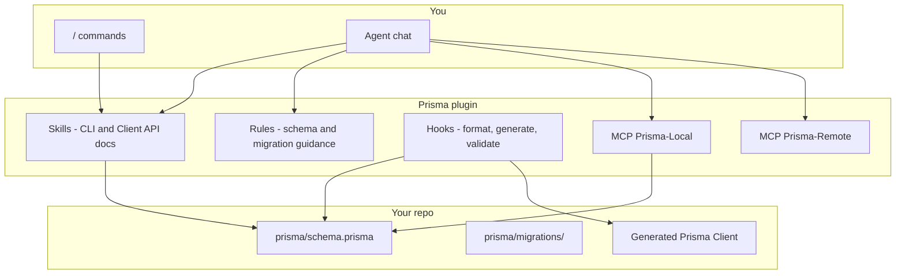
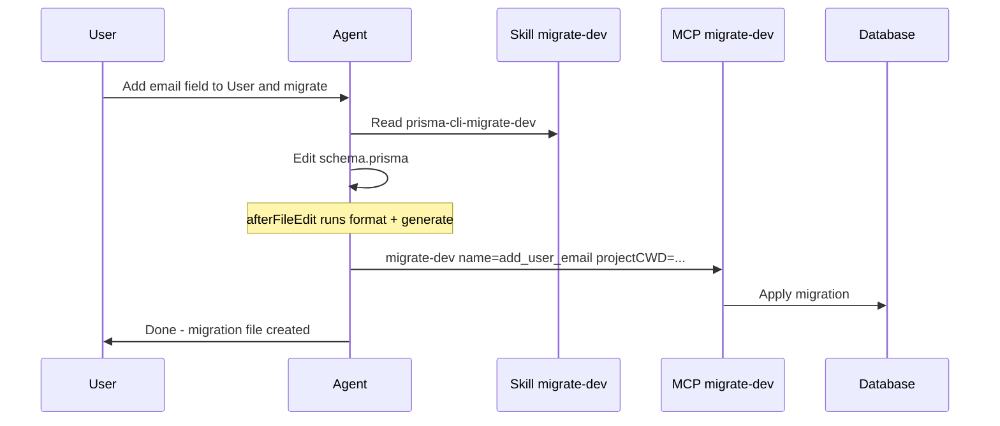

# How the Prisma Cursor plugin works

## What you installed

The plugin is four cooperating layers plus two MCP servers:

| Layer | What it does | How you use it |
|-------|----------------|----------------|
| **Skills** (~40) | Authoritative snippets for each Prisma CLI command and Client API area | Type `/` and pick e.g. `prisma-cli-migrate-dev`; agent auto-loads matching skill when you ask about that command |
| **Rules** (2) | Injected into agent context when relevant | Automatic: `schema-conventions` on `**/*.prisma`; `migration-best-practices` when migrations are discussed |
| **Hooks** (2) | Side effects on edit / shell | Automatic in Cursor when plugin hooks are enabled |
| **MCP servers** (2) | Callable tools instead of raw shell for common workflows | Agent calls MCP tools; you may need to approve tool use |

---

## MCP servers

Configured in the plugin’s [`mcp.json`](file:///Users/soheil/.cursor/plugins/cache/cursor-public/prisma/4584a0a9175ba74053d7ee946c6234d3369a5a33/mcp.json):

### Prisma-Local (no auth required)

- Runs locally via `npx -y prisma mcp` (bundled Prisma CLI MCP).
- Exposed tools in this workspace:
  - `migrate-dev` — create/apply dev migrations (requires `name` + `projectCWD`)
  - `migrate-status` — compare `prisma/migrations` vs database
  - `migrate-reset` — reset dev DB (destructive)
  - `Prisma-Studio` — open Studio UI (`projectCWD` = repo root)

Agents pass **`projectCWD`** as the absolute path to your project root (e.g. `/Users/soheil/Workspace/monobun` or a package subfolder once Prisma lives there).

### Prisma-Remote (authentication required)

- Hosted at `https://mcp.prisma.io/mcp`.
- **Status:** [`STATUS.md`](file:///Users/soheil/.cursor/projects/Users-soheil-Workspace-monobun/mcps/plugin-prisma-Prisma-Remote/STATUS.md) reports the server **needs authentication**.
- Until authenticated, only the `mcp_auth` tool is visible; other remote tools appear after login.
- **To authenticate:** In Cursor, open MCP settings for **plugin-prisma-Prisma-Remote** and complete the flow, or ask the agent (outside plan-only mode) to call `mcp_auth` with `{}` on server `plugin-prisma-Prisma-Remote` — that should open Prisma’s sign-in.

Use **Local** for day-to-day schema/migrate/studio against your machine. Use **Remote** for Prisma Cloud / hosted features once signed in.

---

## Skills (reference library)

Skills are small markdown playbooks (command syntax, options, pitfalls). Grouped roughly as:

- **CLI:** `init`, `format`, `validate`, `generate`, `db push/pull/execute/seed`, `migrate dev/deploy/reset/status/diff/resolve`, `studio`, `debug`, `dev`
- **Client API:** constructor, model queries, filters, relations, transactions, raw queries, query options
- **Database setup:** PostgreSQL, MySQL, SQLite, MongoDB, CockroachDB, SQL Server, Prisma Postgres
- **v7 upgrade:** ESM, env vars, `prisma.config`, driver adapters, schema changes, removed features, Accelerate

The agent is instructed to **read the matching skill** when you mention a feature (e.g. “run migrate dev”) instead of guessing flags from memory.

---

## Rules (always-on guidance)

1. **`schema-conventions`** — applies to `**/*.prisma`: relations both sides, ID defaults, `createdAt`/`updatedAt`, indexes, uniques.
2. **`migration-best-practices`** — review SQL, descriptive migration names, staging before prod, `--create-only` for custom SQL, drift checks.

These shape agent suggestions; they do not run commands by themselves.

---

## Hooks (automation)

From [`hooks.json`](file:///Users/soheil/.cursor/plugins/cache/cursor-public/prisma/4584a0a9175ba74053d7ee946c6234d3369a5a33/hooks.json):

| Hook | Trigger | Action |
|------|---------|--------|
| `beforeShellExecution` | Shell command matches `^git commit` | Runs `prisma validate` if `prisma/schema.prisma` exists |
| `afterFileEdit` | Any file edit (plugin scripts filter to schema) | `prisma format` on schema path |
| `afterFileEdit` | Same | `prisma generate` to refresh Client types |

So a typical edit loop is: change schema → auto-format → auto-generate client; commit attempt → validate schema first.

---

## How you interact day to day

1. **Slash commands** — `/prisma-cli-migrate-dev`, `/prisma-database-setup-postgresql`, etc. to steer the agent with the right playbook.
2. **Natural language** — “Add a User model and migrate” → agent should load skills + rules, use Local MCP or `npx prisma` in terminal, respect hooks.
3. **MCP tool approval** — When the agent calls `migrate-dev` or `Prisma-Studio`, Cursor may prompt you to allow the tool.

---

## Relevance to monobun today

This repo has **no Prisma dependency** in workspace `package.json` files yet. The plugin still installs and its rules/hooks are harmless until you add `prisma/schema.prisma`. To use it fully:

1. Add Prisma to a workspace (often `@apps/express` or a new `packages/db`).
2. Run `prisma init` (skill: `prisma-cli-init`) with your DB URL from Docker Compose / env.
3. Authenticate **Prisma-Remote** if you use Prisma Cloud.
4. Prefer **Local MCP** for migrate/status/studio in development.

---

## Example agent flow (after Prisma is set up)

No implementation steps are required for this overview. If you want Prisma added to monobun next, say which app/package and database (likely Postgres from Compose).
