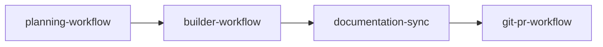

# Initiative workflow

End-to-end order for a planned feature in this repo. Each step uses one skill; **do not** merge steps into one mega-prompt.



Repeat **B → D → G** for each plan phase (each PR).

## Step 1 — Product context (optional)

**When:** Outcome or UX is still fuzzy.

**How:** Short chat (or brainstorming skill from superpowers cache) — problem, users, constraints, non-goals.

**Output:** Bullets the planner pastes into the plan’s summary / Phase 1 design agreement. **Not** a substitute for the plan file.

## Step 2 — planning-workflow

**When:** Multi-package work, phases, or “plan first.”

**Output:** `.cursor/plans/<slug>.plan.md` (approved by you).

**Plan must include per phase:**

| Section | Owner skill |
|---------|-------------|
| Code/config surfaces, scouts, verify commands | builder-workflow |
| **Documentation before PR** (path list) | documentation-sync — **after** build, **not** during |

**Your message (minimal):**

```text
Use planning-workflow.
Goal: …
Constraints: …
Phases: … (one PR per phase if applicable)
```

## Step 3 — builder-workflow (per phase)

**When:** Plan approved; execute **one phase**.

**Scope:** **Code and config only** — no `docs/`, `AGENTS.md`, `README.md`, `.cursor/skills/` edits unless the plan labels a docs-only phase.

**Ends at:** Checkup PASS + code review critical fixes fixed. **Does not commit** (unless you explicitly ask).

**Your message (minimal):**

```text
@.cursor/plans/<slug>.plan.md
Use builder-workflow. Execute Phase N only.
Do not edit documentation tiers; those are step 4.
```

**Do not attach:** rules bodies, full product spec, scout tables from prior runs.

## Step 4 — documentation-sync (per phase, before PR)

**When:** Phase **build is finished** (verify gate passed on code/config). **Before** any commit or PR for that phase.

**Not:** During scout/implement/checkup. **Not** interleaved with implementer slices.

**Input:** Plan section **Documentation before PR** for that phase + current branch diff.

**Your message (minimal):**

```text
Build for Phase N is complete (checkup passed).
Use documentation-sync for paths listed in .cursor/plans/<slug>.plan.md Phase N "Documentation before PR".
```

## Step 5 — git-pr-workflow (per phase)

**When:** Code **and** docs for the phase are done; ready to commit and open PR.

**Prerequisite:** Step 4 finished (docs match code).

**Your message (minimal):**

```text
Use git-pr-workflow. Commit Phase N, push, open draft PR.
```

## One phase checklist

```text
[ ] Plan approved (.cursor/plans/….plan.md)
[ ] builder-workflow Phase N — checkup PASS (code/config only)
[ ] documentation-sync — plan’s doc list updated
[ ] git-pr-workflow — commit, push, PR
[ ] Merge or continue to Phase N+1
```

## Context budget (what to paste)

| Step | Paste |
|------|--------|
| Planning | Goal, constraints, phase count |
| Builder | Plan path + phase number + execute |
| Doc sync | Plan path + “Phase N doc list” + build complete |
| Git/PR | Branch intent, draft vs ready, phase scope |

## Skill index

| Skill | Role |
|-------|------|
| [planning-workflow](../planning-workflow/SKILL.md) | Write plan |
| [builder-workflow](../builder-workflow/SKILL.md) | Execute phase (subagents) |
| [documentation-sync](../documentation-sync/SKILL.md) | Docs after build, before PR |
| [git-pr-workflow](../git-pr-workflow/SKILL.md) | Commit, push, PR |
