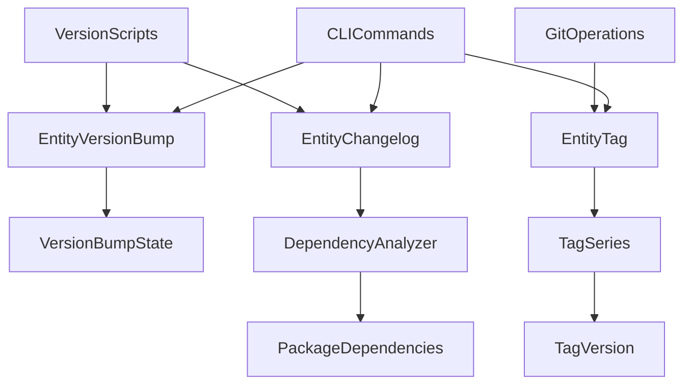

# 🚀 Missing Git Workspace Features: Implementation Plan

> **Final Agreement**: Comprehensive plan for implementing custom version bumping, enhanced changelog management, and multiple tag series support

## 📋 Table of Contents

- [Overview](#-overview)
- [Final Agreement Summary](#final-agreement-summary)
- [Feature 1: Custom Version Bump Types](#feature-1-custom-version-bump-types)
- [Feature 2: Enhanced Changelog Management](#feature-2-enhanced-changelog-management)
- [Feature 3: Multiple Tag Series Support](#feature-3-multiple-tag-series-support)
- [Implementation Roadmap](#implementation-roadmap)
- [Technical Architecture](#technical-architecture)
- [Entity Structure Updates](#entity-structure-updates)
- [CLI Commands](#cli-commands)
- [Integration Points](#integration-points)

## 🎯 Overview

This document captures the final agreement from our conversation about the missing features in the git workspace modeling system. The current system is **85-90% complete** but lacks three critical features that would make it truly powerful and enterprise-ready.

### Current State Assessment

Based on our analysis, your git workspace modeling is **exceptionally well-designed** with:

- ✅ **Domain-Driven Design Excellence**: Clear entity boundaries and rich domain models
- ✅ **Type Safety & Validation**: Comprehensive validation with discriminated unions
- ✅ **Monorepo Support**: Advanced package management and dependency analysis
- ✅ **Core Changelog System**: Automated changelog creation with PR integration
- ✅ **Entity System**: Robust commit, tag, package, and changelog management

### Missing Critical Features

1. **Custom Version Bump Types**: Changesets-style versioning per package
2. **Enhanced Changelog Management**: Features from `@18_CHANGELOG_MANAGEMENT.md`
3. **Multiple Tag Series Support**: Independent versioning for favorite apps/packages with linked-list structure

## 🤝 Final Agreement Summary

### 1. Custom Version Bumping: Temporary State Approach

**Approach**: Use a **temporary state-based system** rather than permanent configuration files.

**Key Benefits**:
- 🎯 **Developer Control**: Developers set version bumps at release time
- 🗂️ **Temporary Files**: No permanent config pollution
- 🔄 **Dynamic**: Changes based on current release needs
- 🧹 **Cleanup**: Automatic cleanup after version application

### 2. Changelog Distribution Strategy

**Root Changelogs**: Every package gets `CHANGELOG.md` (always generated)
**Package-Specific Changelogs**: Every package gets `CHANGELOG.<package>.md` (always generated)

**Changelog Rules**:
- ✅ **Root changelog**: Shows changes from root-level version tags (v1.0.0, v1.1.0, v2.0.0)
- ✅ **Package changelog**: Shows changes from root-level version tags, filtered for package relevance
- ✅ **Version Accuracy**: Package changelog versions reflect the true package version at the time of each root tag
- ✅ **Always Generated**: Both root and package changelogs are always generated for every package
- ✅ **Dependency Analysis**: Check dependencies at the time of each tag, not current state

### 3. Multiple Tag Series: Industry Validation

**Multiple tag series in the same repository is absolutely a good idea** - especially for monorepos.

**Industry Standards**:
- ✅ **Monorepo Best Practice**: Independent versioning of each component
- ✅ **Clear Release Management**: Separate release cycles for different parts
- ✅ **Flexible Release Cycles**: No impact on other packages
- ✅ **Consistent Naming**: `ui-v1.0.0`, `admin-v2.0.0`, `api-v1.5.0`

## 🔧 Feature 1: Custom Version Bump Types

### Architecture Overview

```typescript
// Temporary state directory structure
.intershell/
└── versions/
    ├── ui.json          # {"bumpType": "minor", "reason": "New feature"}
    ├── admin.json       # {"bumpType": "major", "reason": "Breaking change"}
    ├── api.json         # {"bumpType": "none", "reason": "No changes"}
    └── root.json        # {"bumpType": "patch", "reason": "Bug fix"}
```

### CLI Commands

```bash
# Developer sets version bump types
bun run version:set --ui minor --admin major --api none --root patch

# Generate version calculation using temp files
bun run version:prepare

# Apply versions and cleanup temp files
bun run version:apply
```

### Implementation Details

```typescript
// packages/intershell/src/entities/version-bump/types.ts
export interface VersionBumpConfig {
  bumpType: 'major' | 'minor' | 'patch' | 'none';
  reason?: string;
  timestamp: Date;
  author: string;
}

export interface VersionBumpState {
  packages: Record<string, VersionBumpConfig>;
  root: VersionBumpConfig;
  metadata: {
    createdAt: Date;
    expiresAt: Date;
    version: string;
  };
}

// packages/intershell/src/entities/version-bump/version-bump.ts
export class EntityVersionBump {
  async setBumpType(packageName: string, bumpType: VersionBumpConfig): Promise<void> {
    const state = await this.loadState();
    state.packages[packageName] = bumpType;
    await this.saveState(state);
  }
  
  async getBumpTypes(): Promise<VersionBumpState> {
    return await this.loadState();
  }
  
  async cleanup(): Promise<void> {
    await this.removeStateFile();
  }
}
```

## 📝 Feature 2: Enhanced Changelog Management

### Changelog Distribution Strategy

```typescript
// Final changelog structure
packages/ui/
├── CHANGELOG.md          # ✅ Root changelog (always)
└── CHANGELOG.ui.md       # ✅ UI changelog (always) - filtered for UI relevance

packages/admin/  
├── CHANGELOG.md          # ✅ Root changelog (always)
└── CHANGELOG.admin.md    # ✅ Admin changelog (always) - filtered for admin relevance

packages/api/
├── CHANGELOG.md          # ✅ Root changelog (always)
└── CHANGELOG.api.md      # ✅ API changelog (always) - filtered for API relevance
```

### Dependency Analysis at Tag Time

```typescript
// packages/intershell/src/entities/changelog/dependency-analyzer.ts
export class DependencyAnalyzer {
  async getDependenciesAtTag(packageName: string, tagName: string): Promise<string[]> {
    // Check out the specific tag
    await this.git.checkout(tagName);
    
    // Read package.json at that tag
    const packageJson = await this.readPackageJsonAtTag(packageName, tagName);
    
    // Extract dependencies
    const dependencies = {
      ...packageJson.dependencies,
      ...packageJson.devDependencies,
      ...packageJson.peerDependencies
    };
    
    return Object.keys(dependencies);
  }
  
  async isCommitRelatedToPackage(commit: Commit, packageName: string, tagName: string): Promise<boolean> {
    // Get dependencies at the time of the tag
    const dependencies = await this.getDependenciesAtTag(packageName, tagName);
    
    // Check if commit affects the package or its dependencies
    const affectedFiles = await this.getCommitFiles(commit);
    
    return affectedFiles.some(file => 
      file.startsWith(`packages/${packageName}/`) ||
      dependencies.some(dep => file.startsWith(`packages/${dep}/`))
    );
  }
}
```

### Changelog Generation Logic

```typescript
// packages/intershell/src/entities/changelog/changelog-generator.ts
export class ChangelogGenerator {
  async generatePackageChangelog(packageName: string, fromTag: string, toTag: string): Promise<string> {
    // Always generate package changelog for root version tags
    // Get commits between root version tags
    const commits = await this.getCommitsBetween(fromTag, toTag);
    
    // Filter commits relevant to this package
    const relevantCommits = await this.filterRelevantCommits(commits, packageName, toTag);
    
    // Get package version at the time of each root tag
    const packageVersionAtFromTag = await this.getPackageVersionAtTag(packageName, fromTag);
    const packageVersionAtToTag = await this.getPackageVersionAtTag(packageName, toTag);
    
    // Generate changelog content with accurate package versions
    return this.generateChangelogContent(relevantCommits, packageName, {
      fromVersion: packageVersionAtFromTag,
      toVersion: packageVersionAtToTag
    });
  }
  
  async generateRootChangelog(fromTag: string, toTag: string): Promise<string> {
    // Always generate root changelog
    const commits = await this.getCommitsBetween(fromTag, toTag);
    return this.generateChangelogContent(commits, 'root');
  }
}
```

## 🏷️ Feature 3: Multiple Tag Series Support

### Tag Series Architecture

```typescript
// packages/intershell/src/entities/tag/tag-series.ts
export interface TagSeries {
  name: string;                    // 'ui', 'admin', 'api', 'root'
  pattern: string;                 // 'ui-v*', 'admin-v*', 'v*'
  latestVersion: string;           // 'ui-v2.1.0', 'admin-v3.0.0', 'v2.5.0'
  versions: TagVersion[];
}

export interface TagVersion {
  tag: string;                     // 'ui-v2.1.0'
  version: string;                 // '2.1.0'
  commit: string;                  // Commit hash
  date: Date;
  message: string;
  isPrerelease: boolean;           // true for alpha, beta, rc
  prereleaseType?: string;         // 'alpha', 'beta', 'rc'
}

// packages/intershell/src/entities/tag/tag-linked.ts
export class EntityTagLinked {
  // Extends existing EntityTag with linked-list capabilities
  async getSiblingTags(tagName: string): Promise<TagSiblingInfo> {
    const series = await this.getTagSeries(tagName);
    const currentVersion = await this.parseVersion(tagName);
    
    return {
      previous: this.findPreviousVersion(series, currentVersion),
      next: this.findNextVersion(series, currentVersion),
      siblings: this.findSiblingVersions(series, currentVersion),
      series: series
    };
  }
  
  async getTagSeries(tagName: string): Promise<TagSeries> {
    // Detect which series this tag belongs to
    const seriesName = this.detectSeriesName(tagName);
    const pattern = this.getSeriesPattern(seriesName);
    
    // Get all tags matching the pattern using existing EntityTag
    const allTags = await EntityTag.listTags(pattern);
    
    // Parse and sort versions
    const versions = await Promise.all(
      allTags.map(async (tag) => await this.parseTagVersion(tag))
    );
    
    return {
      name: seriesName,
      pattern,
      latestVersion: versions[0]?.tag || '',
      versions: versions.sort((a, b) => this.compareVersions(a.version, b.version))
    };
  }
  
  async getCommitsBetween(from: string, to: string): Promise<CommitInfo[]> {
    // Use existing EntityTag functionality
    return await EntityTag.getCommitsBetween(from, to);
  }
  
  async getPackageVersionsBetween(packageName: string, from: string, to: string): Promise<string[]> {
    const commits = await this.getCommitsBetween(from, to);
    const versions: string[] = [];
    
    for (const commit of commits) {
      const tags = await this.getTagsAtCommit(commit.hash);
      const packageTags = tags.filter(tag => tag.startsWith(`${packageName}-v`));
      versions.push(...packageTags);
    }
    
    return versions;
  }
  
  private detectSeriesName(tagName: string): string {
    if (tagName.startsWith('ui-v')) return 'ui';
    if (tagName.startsWith('admin-v')) return 'admin';
    if (tagName.startsWith('api-v')) return 'api';
    if (tagName.startsWith('v')) return 'root';
    return 'custom';
  }
  
  private getSeriesPattern(seriesName: string): string {
    switch (seriesName) {
      case 'ui': return 'ui-v*';
      case 'admin': return 'admin-v*';
      case 'api': return 'api-v*';
      case 'root': return 'v*';
      default: return `${seriesName}-*`;
    }
  }
}
```

### Tag Series Examples

```bash
# Root series (always present)
v1.0.0, v1.1.0, v1.2.0, v2.0.0, v2.1.0

# UI package series
ui-v1.0.0, ui-v1.1.0, ui-v1.2.0, ui-v2.0.0

# Admin package series  
admin-v1.0.0, admin-v2.0.0, admin-v2.1.0, admin-v3.0.0

# API package series
api-v1.0.0, api-v1.1.0, api-v1.2.0

# Prerelease series
ui-v2.2.0-alpha, ui-v2.2.0-beta, ui-v2.2.0-rc, ui-v2.2.0
```

## 🚀 Implementation Roadmap

### Phase 1: Foundation (Week 1-2)

#### 1.1 Version Bump System
- [ ] Create `EntityVersionBump` entity
- [ ] Implement temporary state management
- [ ] Add CLI commands for version bump setting
- [ ] Integrate with existing version scripts

#### 1.2 Tag Series Management
- [ ] Extend `EntityTag` with series support
- [ ] Implement tag series detection and tracking
- [ ] Add sibling tag navigation
- [ ] Create tag series validation

### Phase 2: Enhanced Changelog (Week 3-4)

#### 2.1 Dependency Analysis
- [ ] Implement `DependencyAnalyzer` class
- [ ] Add tag-time dependency checking
- [ ] Create commit filtering logic
- [ ] Integrate with changelog generation

#### 2.2 Changelog Distribution
- [ ] Update `EntityChangelog` for package-specific generation
- [ ] Implement conditional changelog creation
- [ ] Add root vs package changelog logic
- [ ] Create changelog cleanup and management

### Phase 3: Integration & Testing (Week 5-6)

#### 3.1 System Integration
- [ ] Connect version bump system with version scripts
- [ ] Integrate tag series with changelog generation
- [ ] Update existing CLI commands
- [ ] Add comprehensive error handling

#### 3.2 Testing & Validation
- [ ] Unit tests for all new entities
- [ ] Integration tests for complete workflows
- [ ] Performance testing for large repositories
- [ ] Edge case validation

## 🏗️ Technical Architecture

### Entity Relationships



### Data Flow

```typescript
// Version bump workflow
interface VersionBumpWorkflow {
  // 1. Developer sets version bumps
  setBumpTypes: (bumps: Record<string, VersionBumpConfig>) => Promise<void>;
  
  // 2. Version calculation
  calculateVersions: () => Promise<VersionCalculation>;
  
  // 3. Changelog generation
  generateChangelogs: (versions: VersionCalculation) => Promise<void>;
  
  // 4. Version application
  applyVersions: (versions: VersionCalculation) => Promise<void>;
  
  // 5. Cleanup
  cleanup: () => Promise<void>;
}
```

## 🔄 Entity Structure Updates

### New Entities

```typescript
// packages/intershell/src/entities/version-bump/
export * from './types';
export * from './version-bump';
export * from './state-manager';

// packages/intershell/src/entities/tag/
export * from './types';
export * from './tag';              // Existing EntityTag
export * from './tag-series';       // New interfaces
export * from './tag-linked';       // New EntityTagLinked for linked-list structure

// packages/intershell/src/entities/changelog/
export * from './types';
export * from './changelog';
export * from './dependency-analyzer';
export * from './changelog-generator';
```

### Updated Entities

```typescript
// packages/intershell/src/entities/changelog/changelog.ts
export class EntityChangelog {
  // New methods for package-specific changelogs
  async generatePackageChangelog(packageName: string, fromTag: string, toTag: string): Promise<string>;
  async generateRootChangelog(fromTag: string, toTag: string): Promise<string>;
  async shouldGeneratePackageChangelog(packageName: string): Promise<boolean>;
  
  // Enhanced dependency analysis
  async getRelevantCommits(commits: Commit[], packageName: string, tagName: string): Promise<Commit[]>;
}
```

## 🖥️ CLI Commands

### Version Management Commands

```bash
# Set version bump types for packages
bun run version:set --ui minor --admin major --api none --root patch

# Preview version changes
bun run version:preview

# Generate version calculation
bun run version:prepare

# Apply versions and cleanup
bun run version:apply

# List current version bump state
bun run version:status

# Clear version bump state
bun run version:clear
```

### Tag Management Commands

```bash
# Create tag with series detection
bun run tag:create ui-v2.1.0 "New UI features"

# List tag series
bun run tag:series

# Get sibling tags
bun run tag:siblings ui-v2.1.0

# Get commits between tags
bun run tag:commits ui-v1.0.0 ui-v2.0.0

# Get package versions between tags
bun run tag:package-versions ui v1.0.0 v2.0.0
```

### Changelog Commands

```bash
# Generate changelog for specific package
bun run changelog:generate --package ui

# Generate root changelog
bun run changelog:generate --package root

# Generate all changelogs
bun run changelog:generate --all

# Preview changelog changes
bun run changelog:preview --package ui

# Validate changelog completeness
bun run changelog:validate
```

## 🔗 Integration Points

### Existing Scripts Integration

```typescript
// scripts/version-prepare.ts
import { EntityVersionBump, EntityChangelog } from '@repo/intershell';

export async function versionPrepare(): Promise<void> {
  // Load version bump state
  const versionBump = new EntityVersionBump();
  const bumpState = await versionBump.getBumpTypes();
  
  // Calculate new versions
  const newVersions = calculateNewVersions(bumpState);
  
  // Generate changelogs
  const changelog = new EntityChangelog();
  await changelog.generateAllChangelogs(newVersions);
  
  // Save version state for apply step
  await saveVersionState(newVersions);
}
```

### CI/CD Integration

```yaml
# .github/workflows/version-management.yml
name: Version Management
on:
  workflow_dispatch:
    inputs:
      package:
        description: 'Package to version'
        required: true
        type: choice
        options:
          - ui
          - admin
          - api
          - root
      bump_type:
        description: 'Version bump type'
        required: true
        type: choice
        options:
          - major
          - minor
          - patch
          - none

jobs:
  version-package:
    runs-on: ubuntu-latest
    steps:
      - uses: actions/checkout@v4
      - uses: oven-sh/setup-bun@v1
      
      - name: Set version bump
        run: |
          bun run version:set --${{ inputs.package }} ${{ inputs.bump_type }}
          
      - name: Prepare version
        run: bun run version:prepare
        
      - name: Create PR
        run: bun run version:create-pr
```

## 📊 Success Metrics

### Technical Metrics
- [ ] **100% test coverage** for new entities
- [ ] **< 100ms response time** for tag series operations
- [ ] **Zero data loss** in version bump state management
- [ ] **Automatic cleanup** of temporary files

### Developer Experience Metrics
- [ ] **Single command** version bump setting
- [ ] **Intuitive CLI** for all operations
- [ ] **Clear feedback** for all operations
- [ ] **Comprehensive help** for all commands

### Business Metrics
- [ ] **Faster releases** with automated versioning
- [ ] **Better changelog quality** with package-specific generation
- [ ] **Improved traceability** with tag series management
- [ ] **Reduced errors** in version management

## 🔮 Future Enhancements

### Advanced Features
- [ ] **Semantic versioning** with conventional commits
- [ ] **Release notes generation** from changelogs
- [ ] **Dependency impact analysis** for breaking changes
- [ ] **Automated release** with GitHub releases

### Integration Features
- [ ] **Slack notifications** for version releases
- [ ] **Jira integration** for issue tracking
- [ ] **Confluence integration** for documentation
- [ ] **Metrics dashboard** for release analytics

---

**Missing Git Workspace Features**: This document provides a comprehensive implementation plan for the three critical missing features that will make your git workspace modeling system truly enterprise-ready and powerful. The approach focuses on developer experience, maintainability, and integration with existing systems while maintaining the high quality and architectural excellence of your current implementation.
